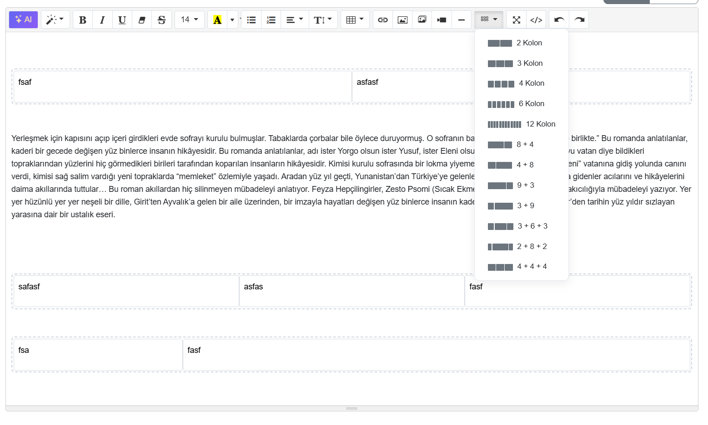

# Summernote Grid Plugin



A robust Bootstrap grid layout plugin for [Summernote](https://summernote.org/) WYSIWYG editor.

Unlike other grid plugins, this one uses **contenteditable isolation** — each column is an independent editing zone. Content you paste, type, or embed stays inside its column. No more broken layouts.

## The Problem

Summernote (and most contenteditable-based editors) treats the entire editing area as one block. When you insert a grid with `<div class="row"><div class="col-md-6">...`, pasting content, pressing backspace, or inserting media can destroy the grid structure — deleting columns or pushing content outside.

## The Solution

This plugin creates grids where:
- **Row** has `contenteditable="false"` — Summernote can't touch it
- **Each column** has `contenteditable="true"` — independent editing zone
- **Paste events** are intercepted and sandboxed per column
- **Backspace/Delete** can't accidentally remove a column
- **Tab** key navigates between columns
- **Videos/iframes** respect column boundaries with proper aspect ratios
- A **delete button** appears when clicking the grid border

## Features

- 12 pre-built responsive layouts (equal and asymmetric)
- Visual preview in dropdown menu
- Bootstrap 5 grid classes (`col-md-*`)
- Paste protection (HTML + plain text)
- Keyboard navigation (Tab / Shift+Tab)
- Backspace safety (empty columns survive)
- Auto-protection for existing grids on editor init
- One-click grid deletion
- Mobile responsive (stacks on small screens)
- Lightweight (~4KB minified)

## Available Layouts

| Layout | Columns |
|--------|---------|
| 2 Kolon | `col-md-6` + `col-md-6` |
| 3 Kolon | `col-md-4` x 3 |
| 4 Kolon | `col-md-3` x 4 |
| 6 Kolon | `col-md-2` x 6 |
| 12 Kolon | `col-md-1` x 12 |
| 8 + 4 | `col-md-8` + `col-md-4` |
| 4 + 8 | `col-md-4` + `col-md-8` |
| 9 + 3 | `col-md-9` + `col-md-3` |
| 3 + 9 | `col-md-3` + `col-md-9` |
| 3 + 6 + 3 | `col-md-3` + `col-md-6` + `col-md-3` |
| 2 + 8 + 2 | `col-md-2` + `col-md-8` + `col-md-2` |

## Installation

### CDN

```html
<link href="https://cdn.jsdelivr.net/npm/summernote-grid-plugin@latest/dist/summernote-grid.min.css" rel="stylesheet">
<script src="https://cdn.jsdelivr.net/npm/summernote-grid-plugin@latest/dist/summernote-grid.min.js"></script>
```

### npm

```bash
npm install summernote-grid-plugin
```

### Manual

Download `dist/summernote-grid.min.js` and `dist/summernote-grid.min.css`, include them after Summernote.

## Usage

```html
<!-- Dependencies -->
<link href="https://cdn.jsdelivr.net/npm/bootstrap@5.3.3/dist/css/bootstrap.min.css" rel="stylesheet">
<link href="https://cdn.jsdelivr.net/npm/bootstrap-icons@1.11.3/font/bootstrap-icons.min.css" rel="stylesheet">
<link href="https://cdn.jsdelivr.net/npm/summernote@0.9.0/dist/summernote-lite.min.css" rel="stylesheet">
<link href="summernote-grid.min.css" rel="stylesheet">

<script src="https://cdn.jsdelivr.net/npm/jquery@3.7.1/dist/jquery.min.js"></script>
<script src="https://cdn.jsdelivr.net/npm/bootstrap@5.3.3/dist/js/bootstrap.bundle.min.js"></script>
<script src="https://cdn.jsdelivr.net/npm/summernote@0.9.0/dist/summernote-lite.min.js"></script>
<script src="summernote-grid.min.js"></script>

<!-- Editor -->
<textarea id="editor"></textarea>

<script>
$('#editor').summernote({
    toolbar: [
        ['style', ['style']],
        ['font', ['bold', 'italic', 'underline']],
        ['para', ['ul', 'ol', 'paragraph']],
        ['table', ['table']],
        ['insert', ['link', 'picture', 'video']],
        ['grid', ['grid']],   // <-- Add grid to toolbar
        ['view', ['fullscreen', 'codeview']]
    ]
});
</script>
```

That's it. Click the grid icon in the toolbar, pick a layout, and start editing inside columns.

## How It Works

```
+--------------------------------------------------+
|  .sn-grid  (contenteditable="false")              |
|  Summernote cannot modify this container          |
|                                                    |
|  +---------------------+ +---------------------+  |
|  | .sn-grid-col        | | .sn-grid-col        |  |
|  | contenteditable=true | | contenteditable=true |  |
|  |                      | |                      |  |
|  | Your content here.   | | Independent zone.    |  |
|  | Paste works.         | | Paste works.         |  |
|  | Backspace is safe.   | | Videos embed fine.   |  |
|  +---------------------+ +---------------------+  |
+--------------------------------------------------+
```

## Browser Support

Works in all modern browsers that support `contenteditable` and CSS Flexbox:
- Chrome 60+
- Firefox 55+
- Safari 12+
- Edge 79+

## Requirements

- [jQuery](https://jquery.com/) >= 3.0
- [Summernote](https://summernote.org/) >= 0.8 (lite or full)
- [Bootstrap](https://getbootstrap.com/) >= 5.0 (for grid classes)
- [Bootstrap Icons](https://icons.getbootstrap.com/) (for toolbar icon)

## License

MIT License - see [LICENSE](LICENSE) for details.
